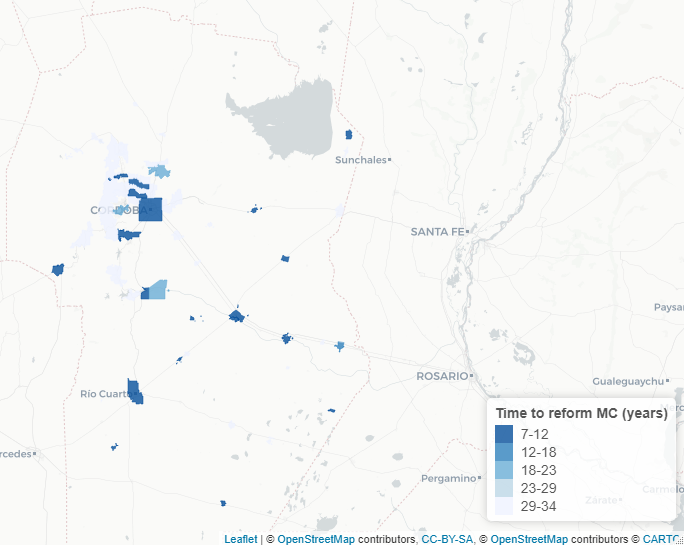

This is a replication code in *R* for "Spatial Inequalities Shaping Institutional Design. Municipal Charters in Argentina
================


> **Abstract:** This paper explores the effect of socio-economic segregation on the probability of sanctioning Municipal Charters (MC) for municipalities in Argentina. Using Census data for years 2001 and 2010, I first develop municipal segregation measures for three variables; education levels, unsatisfied basic needs, and overcrowded households. The Gini Segregation Index (G) and the Information Theory Index (H) are obtained taking advantage of the disaggregation of municipalities in census tracts units. Subsequently, exploiting the timing of plausibly exogenous provincial constitutional reforms granting municipalities the right to adopt MC, I analyse the time to reform and the main factors driving this decision. The findings indicate a positive and consistent association between segregation indexes and the likelihood of adopting a charter; the more unequal distribution of socio-economic characteristics, the swifter the municipality will have its MC sanctioned.*


### Unsatisfied Basic Needs (UBN) Gini Segregation:
<!-- 
-->

<!--
```{r}
knitr::include_graphics("./images/cba_gini_segregation.PNG",  error = F)
```
-->


### Time to Reform Municipal Charters (MC) in years:
<!-- 
-->
